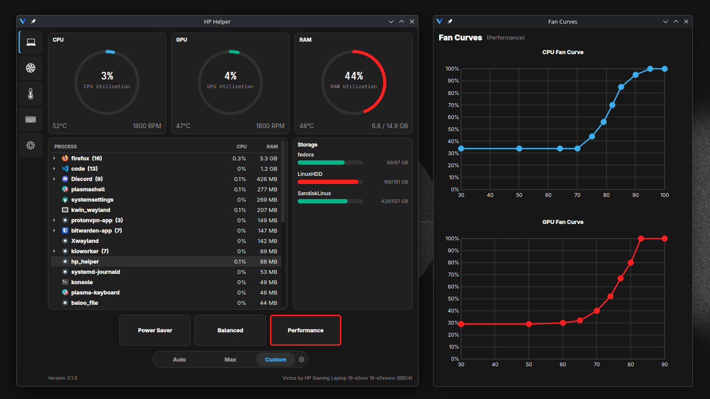
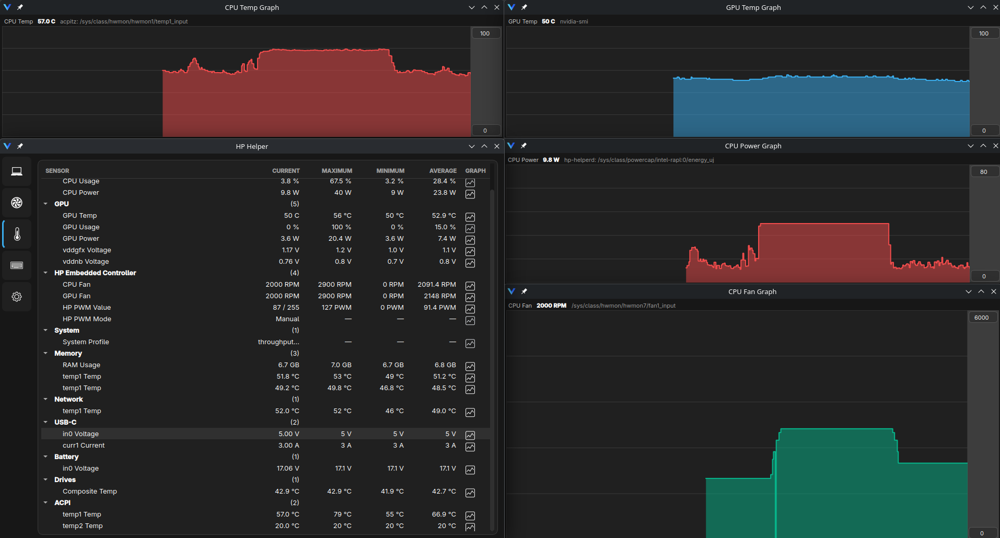
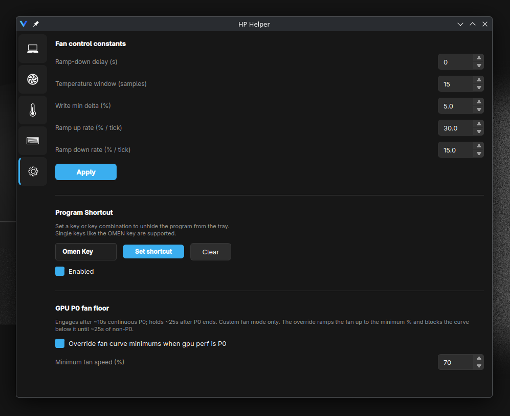

# Victus Hub


Sensors Panel            |  Settings Panel
:-------------------------:|:-------------------------:
  |  

A control panel for HP Victus and Omen laptops on Linux. 

It was built and tested on 8BD4 (HP Victus 16-s0001nv) 
with Fedora. Other HP Omen/Victus laptops should work.


## What it does
- **System profiles** — maps the three UI profiles to `tuned-adm` (tested on fedora acpi profile is set correctly)
   or `power-profilesctl` if available.
- **Custom fan control** — Three modes:
  *auto* (hands control back to the EC), *max* (100%), and *custom* (your
  temperature curves with ramp-up/down).
- **Mux switch** Hardware Mux switch support for Victus Laptops, OMEN Laptops should also work (untested).  PRIME laptops can also try [envycontrol](https://github.com/bayasdev/envycontrol) (not included yet).  
- **Keyboard RGB** — static color and brightness via a custom
  `hp-kbd-rgb` kernel module (a companion to the upstream hp-wmi RGB
  patch series; it doesn't claim the HP WMI GUID, so the stock `hp-wmi`
  driver stays loaded for hotkeys and fan hwmon). Optional idle-dim when
  you stop typing.
- **Power limits** — set Sustained (sPPT), Fast (fPPT), and Slow limits,
  plus Tctl temperature, through `ryzenadj` for amd cpus.
- **Sensors** — live CPU/GPU temperatures, fan RPM, power draw, and
  utilization. Included "task manager"+right click to stop processes, tracks cpu and ram (PSS).
- **Suspend/shutdown cleanup** — send suspend and shutdown commands before and after.

Settings persist under `~/.config/victus-hub/`.

## Install (One-Liner)
```
curl -sL https://raw.githubusercontent.com/evident0/victus-hub/master/install.sh | sudo bash
```
## Uninstall (One-Liner)
```
curl -sL https://raw.githubusercontent.com/evident0/victus-hub/master/uninstall.sh | sudo bash
```
## Installing (manual)

After cloning the repository run:

```
./scripts/install
```
For dev work (no .desktop entry etc. Run uninstall when done testing to remove just the daemon):

```
./scripts/dev-run
```

## Uninstalling

```
./scripts/uninstall
```
Your settings under `~/.config/victus-hub/` are left in place. Removes everything else

## Running

From the application menu (look for "Victus Hub"), or:

```
victus-hub
```

It runs as a tray app — closing the window hides it to the system tray.
Click the tray icon to bring it back, or use the global hotkey you can
configure in the Settings page. A second launch raises the existing
instance rather than starting a new one.

## Logging/Debugging

The app logs to the terminal it was launched from (so run it from a
terminal or check the desktop entry's output). The daemon logs via
`journalctl -u victus-hubd`.

## Project Structure

- **`victus_hub/`** — the Qt GUI. The user runs this unprivileged. It
  talks to the daemon over a Unix socket for anything requiring root.
- **`victus_hubd/`** — the root daemon. Runs as a systemd service
  (`victus-hubd.service`), listens on `/run/victus-hubd/victus-hub.sock`,
- **`kernel/`** — All custom kernel modules.
