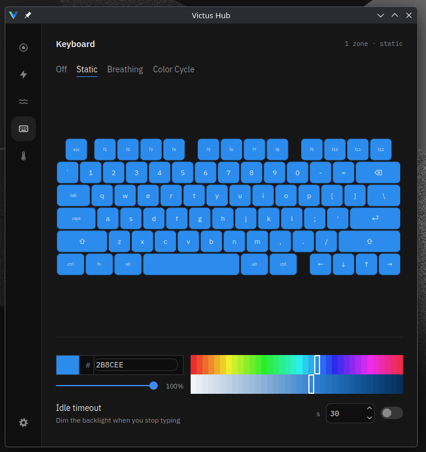
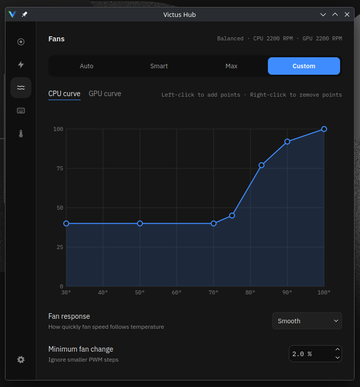

# Victus Hub


A lightweight control panel for HP Victus and Omen laptops on Linux. 

It was built and tested on 8BD4 (HP Victus 16-s0001nv) 
with Fedora.

## Install (One-Liner)
```
curl -sL https://raw.githubusercontent.com/evident0/victus-hub/master/install.sh | sudo bash
```
The installer checks prerequisites before changing the system. If anything is
missing it stops, lists the requirements, and prints Ubuntu/Mint/Debian, Arch,
or Fedora package commands. **Install the missing packages yourself**, then
rerun it. It does not automatically install distribution packages.

Requirements include Python 3.10+, Python venv/ensurepip, systemd/logind, Qt
runtime libraries, DKMS, build tools, and headers matching the running kernel.
The bundled hp-wmi needs newer platform-profile kernel APIs; upstream 6.8 and
6.12 do not provide them. Preflight reports this when the relevant header is
available. DKMS handles rebuilds, not compatibility with arbitrary kernel APIs.

The app is installed into a root-owned virtual environment under
`/opt/victus-hub-app/`, with a launcher at `/usr/local/bin/victus-hub`.
Neither the GUI nor daemon relies on an editable checkout or system-wide pip.
## Uninstall (One-Liner)
```
curl -sL https://raw.githubusercontent.com/evident0/victus-hub/master/uninstall.sh | sudo bash
```

## What it does
- **System profiles** — maps the three UI profiles to `tuned-adm`
   or `power-profilesctl`.
- **Custom fan control** — Four modes:
  *auto* (hands control back to the EC), *smart* (built-in curve, fast
  on heat / slow on cooldown), *max* (100%), and *custom* (your
  temperature curves).
- **Mux switch** Hardware Mux switch support.
- **Keyboard RGB** — static color and brightness via a custom
  `hp-kbd-rgb` kernel module. Optional idle-dim when
  you stop typing.
- **Power limits** — set Sustained (sPPT), Fast (fPPT), and Slow limits,
  plus Tctl temperature, through `ryzenadj` for AMD CPUs. Intel CPUs show
  PL1 (long-term) and PL2 (short-term) limits using Linux RAPL.
- **Intel undervolt** — core and cache voltage offsets below the frequency
  controls, from -250 to 0 mV. Requires the `msr` kernel module
  (`sudo modprobe msr`) and unlocked firmware voltage control. Apply errors
  are shown in the panel; successful offsets are saved but only applied on
  clicking **Apply undervolt**. Set both offsets to 0 mV to reset them.
- **Sensors** — live CPU/GPU temperatures, fan RPM, power draw, and
  utilization.
- **Keyboard control shortcuts** Keyboard shortcuts for lighting and performance mode. 

Settings persist under `~/.config/victus-hub/`.

Keyboard Panel            |  Fans Panel
:-------------------------:|:-------------------------:
  |  

## Installing (manual)

After cloning the repository run:

```
./scripts/install
```

To check requirements without installing anything:

```bash
bash scripts/install --check
```

RGB is optional: if `hp-kbd-rgb` cannot load (for example on a keyboard without
supported RGB), installation continues with a message and disables its boot
autoload entry. Fan control and the rest of the app can still be installed.
Driver compilation/signing errors are reported as installation failures.

### Secure Boot

Secure Boot can stay enabled. Install `mokutil`, `openssl`, and the kernel
headers/devel package matching `uname -r` before running the installer. Both
custom drivers (`hp-wmi` and `hp-kbd-rgb`) are signed automatically using a
shared key stored under `/var/lib/victus-hub/mok/` with root-only access.

On the first install, choose a one-time password when `mokutil` prompts you
(this also works with the one-liner installer). Installation finishes, but
the new drivers are not loaded until you enroll the key:

1. Reboot into the **MOK Manager** screen provided by your shim bootloader.
2. Choose **Enroll MOK → Continue → Yes**.
3. Enter the password you chose during installation, then reboot again.

The signed drivers are configured to load at boot. Until enrollment is
complete, features requiring the custom drivers may be unavailable. A
shim/MOK-capable boot chain is required for this enrollment workflow.
If installing without a terminal, or if you need to retry enrollment, run:

```bash
sudo mokutil --import /var/lib/victus-hub/mok/MOK.der
```

Reinstalls reuse the same key, so enrollment is only needed once. The key is
preserved by uninstalling as well. With Secure Boot enabled, DKMS 3 or newer
is required. The installer configures DKMS's signing-key defaults in
`/etc/dkms/framework.conf.d/victus-hub.conf` to use this enrolled key. This
applies to subsequent DKMS builds, including other DKMS drivers; existing
configuration files and enrolled certificates are retained.

### Kernel updates

The main installer registers both drivers with DKMS using root-owned source
copies under `/usr/src/victus-hub-hp-*`. Distribution DKMS kernel/header hooks
automatically rebuild them for new kernels. **Keep matching kernel headers
installed** (on Arch use the headers package for your kernel flavour).
The hp-wmi hook updates module selection and regenerates the initramfs using
the installed distro tool. Uninstall removes DKMS registrations for all kernels.

Check `dkms status` after a kernel update. A future incompatible kernel can
still cause a build failure; inspect `/var/lib/dkms/` build logs and boot the
previous working kernel until the driver is updated. The low-level scripts
under `kernel/*/scripts/` remain single-kernel development helpers; use the
main installer for DKMS-managed distribution installs.

## Uninstalling

```
./scripts/uninstall
```
Your settings under `~/.config/victus-hub/` and Secure Boot signing keys under
`/var/lib/victus-hub/mok/` are left in place.

## Running

From the application menu (look for "Victus Hub"), or:

```
victus-hub
```

It runs as a tray app — closing the window hides it to the system tray.
Click the tray icon to bring it back, or use the global hotkey you can
configure in the Settings page. A second launch raises the existing
instance rather than starting a new one.

Daemon commands require root or an active, unlocked local graphical session
on `seat0`, verified through Unix peer credentials and systemd-logind. Remote,
inactive, locked, and non-graphical sessions cannot issue commands. Root-only
system hooks still work during suspend/shutdown. The daemon fails closed when
session authorization cannot be determined.

Program shortcuts are captured only inside the focused app window. Use
Ctrl/Alt/Super with another key, or a function/OMEN key. The daemon exports
only activation of the registered shortcut, never ordinary keypresses or a
last-key history. Existing ordinary-key-only bindings need to be reassigned.
Shortcut delivery is reauthorized for each event and paused while locked or
switched away; daemon-owned fan/lighting policies continue running.

Hardware control (fan curves, keyboard lighting, power-limit reapply,
battery power-save, and Ctrl+Shift shortcuts) runs in `victus-hubd`.
Quitting the UI leaves those settings active. Suspend and shutdown still
hand fans back to the EC and turn the keyboard backlight off.

## Logging/Debugging

To refresh the app and daemon after editing this checkout, run from your
desktop session **without sudo**:

```bash
./scripts/reload
```

This refreshes the app-only installation, restarts `victus-hubd`, and restarts
your UI using the current checkout. It requests sudo for system changes and
leaves kernel modules and the RyzenAdj installation in place. The UI runs in
the terminal; the daemon stays running after it closes.

`scripts/reload` also accepts the debug levels below (for example,
`./scripts/reload 3`).

The app logs to the terminal it was launched from (so run it from a
terminal or check the desktop entry's output). The daemon logs via
`journalctl -u victus-hubd`.

Both development scripts accept an optional terminal debug level:

| Level | Terminal messages |
| --- | --- |
| `0` (default) | Errors only |
| `1` | Errors + fan control |
| `2` | Errors + fan control + power |
| `3` | Errors + fan control + power + keyboard |

```bash
./scripts/dev-run 1
./scripts/ui-test 3
```

For a direct launch, use `VICTUS_HUB_DEBUG_LEVEL=2 victus-hub` (the same
environment variable is supported by `python3 -m victus_hubd`).

## Project Structure

- **`victus_hub/`** — the Qt GUI. The user runs this unprivileged. It
  sends desired state (fan curves, lighting, power policy) to the daemon
  over a Unix socket. Sensor display and the keyboard preview stay in the UI.
- **`victus_hubd/`** — the root daemon. Runs as a systemd service
  (`victus-hubd.service`), listens on `/run/victus-hubd/victus-hub.sock`,
  owns the control loops, and persists last policy under
  `/var/lib/victus-hubd/` so fans, lighting, and power limits keep working
  with the UI closed (a CLI can use the same socket later).
- **`kernel/`** — All custom kernel modules.

The bundled `hp-wmi` is based on `hp-wmi-ilpo-appliednew.c`, with an out-of-tree
ACPI compatibility definition and a read-only `gpu_mux_supported_names` attribute
for the app. MUX nodes live under `/sys/devices/platform/hp-wmi/`. Fan mode is
shared through `pwm1_enable`; the app applies its combined fan target to both
`pwm1` (CPU) and `pwm2` (GPU).

## Credits

- **P4R1H (https://ohmanapp.github.io/)** For the ui design that I recreated in qt with qt creator. 
- **Literally anyone who contributed code to the hp-wmi driver** <3.
