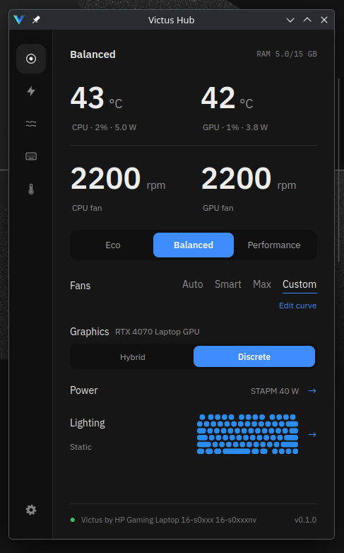
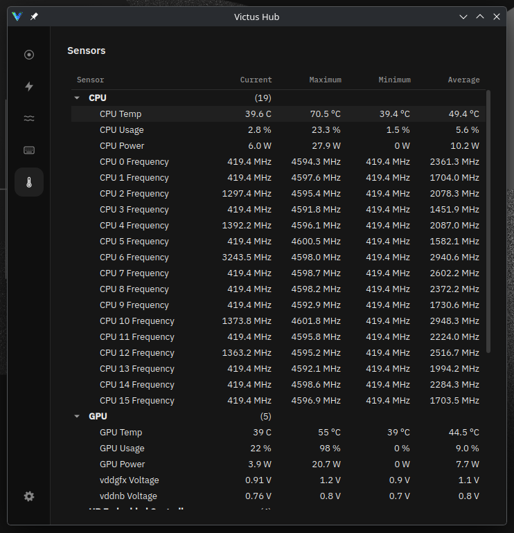
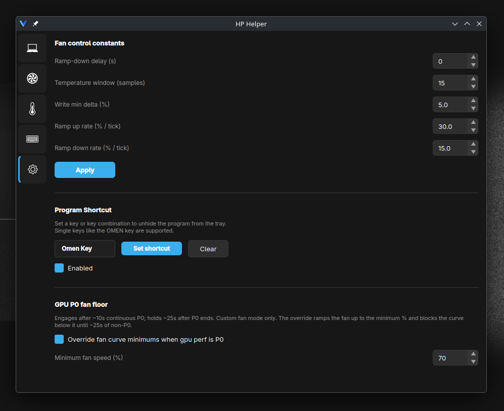

# Victus Hub


Sensors Panel            |  Settings Panel
:-------------------------:|:-------------------------:
  |  

A control panel for HP Victus and Omen laptops on Linux. 

It was built and tested on 8BD4 (HP Victus 16-s0001nv) 
with Fedora. Other HP Omen/Victus laptops should work.


## What it does
- **System profiles** — maps the three UI profiles to `tuned-adm` (tested on fedora acpi profile is set correctly)
   or `power-profilesctl` if available.
- **Custom fan control** — Four modes:
  *auto* (hands control back to the EC), *smart* (built-in curve, fast
  on heat / slow on cooldown), *max* (100%), and *custom* (your
  temperature curves).
- **Mux switch** Hardware Mux switch support for Victus Laptops, OMEN Laptops should also work (untested).  PRIME laptops can also try [envycontrol](https://github.com/bayasdev/envycontrol) (not included yet).  
- **Keyboard RGB** — static color and brightness via a custom
  `hp-kbd-rgb` kernel module (a companion to the upstream hp-wmi RGB
  patch series; it doesn't claim the HP WMI GUID, so custom `hp-wmi`
  stays loaded for hotkeys, fan hwmon, and MUX control). Optional idle-dim when
  you stop typing.
- **Power limits** — set Sustained (sPPT), Fast (fPPT), and Slow limits,
  plus Tctl temperature, through `ryzenadj` for AMD CPUs. Intel CPUs show
  PL1 (long-term) and PL2 (short-term) limits using Linux RAPL, with the
  same automatic reapply interval. Intel and AMD power settings are stored separately.
- **CPU frequency limits** — minimum/maximum frequencies across all Linux
  CPU frequency policies, including `intel_pstate` and `acpi-cpufreq`.
- **Intel undervolt** — core and cache voltage offsets below the frequency
  controls, from -250 to 0 mV. Requires the `msr` kernel module
  (`sudo modprobe msr`) and unlocked firmware voltage control. Apply errors
  are shown in the panel; successful offsets are saved but only applied on
  clicking **Apply undervolt**. Set both offsets to 0 mV to reset them.
- **Sensors** — live CPU/GPU temperatures, fan RPM, power draw, and
  utilization.
- **Suspend/shutdown cleanup** — send suspend and shutdown commands before and after.

Settings persist under `~/.config/victus-hub/`.

Enable **Settings → Keyboard control shortcuts**, then hold **Left Ctrl + Left Shift**:
- **Up/Down:** keyboard brightness (0%, 25%, 50%, 75%, 100%).
- **Left/Right:** previous/next lighting effect, including Off.
- **M:** cycle Eco (Power Save) → Balanced → Performance.

Both modifiers must be the left-hand keys. Shortcuts work while the app is running,
including in the tray.
Shortcut delivery uses a persistent daemon event stream, with no keyboard
polling timer. Restart `victus-hubd` and the app after upgrading to this version.

## Install (One-Liner)
```
curl -sL https://raw.githubusercontent.com/evident0/victus-hub/master/install.sh | sudo bash
```
## Uninstall (One-Liner)
```
curl -sL https://raw.githubusercontent.com/evident0/victus-hub/master/uninstall.sh | sudo bash
```
## Installing (manual)

After cloning the repository run:

```
./scripts/install
```
After updating an existing installation, rerun the installer to update and
restart the daemon, including the RAPL/MSR service permissions for Intel controls.
The installer builds and installs custom `hp-wmi` (including MUX support) and
`hp-kbd-rgb`, and builds/installs RyzenAdj on AMD CPUs, without component prompts.
Kernel headers for the running kernel are required. Upgrades remove the old
standalone `hp-gpu-mux` installation.

For dev work (no .desktop entry; still prompts before installing/rebuilding each
module and RyzenAdj):

```
./scripts/dev-run
```

## Uninstalling

```
./scripts/uninstall
```
Your settings under `~/.config/victus-hub/` are left in place. Removes everything else

## Running

From the application menu (look for "Victus Hub"), or:

```
victus-hub
```

It runs as a tray app — closing the window hides it to the system tray.
Click the tray icon to bring it back, or use the global hotkey you can
configure in the Settings page. A second launch raises the existing
instance rather than starting a new one.

Hardware control (fan curves, keyboard lighting, power-limit reapply,
battery power-save, and Ctrl+Shift shortcuts) runs in `victus-hubd`.
Quitting the UI leaves those settings active. Suspend and shutdown still
hand fans back to the EC and turn the keyboard backlight off.

## Logging/Debugging

The app logs to the terminal it was launched from (so run it from a
terminal or check the desktop entry's output). The daemon logs via
`journalctl -u victus-hubd`.

Both development scripts accept an optional terminal debug level:

| Level | Terminal messages |
| --- | --- |
| `0` (default) | Errors only |
| `1` | Errors + fan control |
| `2` | Errors + fan control + power |
| `3` | Errors + fan control + power + keyboard |

```bash
./scripts/dev-run 1
./scripts/ui-test 3
```

From the `scripts/` directory, use `./dev-run 1` or `./ui-test 3`.
These levels filter application log messages and the in-app diagnostics
session log; script setup progress is still shown.
`./scripts/install` pins the desktop entry to level `0`.
For a direct launch, use `VICTUS_HUB_DEBUG_LEVEL=2 victus-hub` (the same
environment variable is supported by `python3 -m victus_hubd`).

## Project Structure

- **`victus_hub/`** — the Qt GUI. The user runs this unprivileged. It
  sends desired state (fan curves, lighting, power policy) to the daemon
  over a Unix socket. Sensor display and the keyboard preview stay in the UI.
- **`victus_hubd/`** — the root daemon. Runs as a systemd service
  (`victus-hubd.service`), listens on `/run/victus-hubd/victus-hub.sock`,
  owns the control loops, and persists last policy under
  `/var/lib/victus-hubd/` so fans, lighting, and power limits keep working
  with the UI closed (a CLI can use the same socket later).
- **`kernel/`** — All custom kernel modules.

The bundled `hp-wmi` is based on `hp-wmi-ilpo-appliednew.c`, with an out-of-tree
ACPI compatibility definition and a read-only `gpu_mux_supported_names` attribute
for the app. MUX nodes live under `/sys/devices/platform/hp-wmi/`. Fan mode is
shared through `pwm1_enable`; the app applies its combined fan target to both
`pwm1` (CPU) and `pwm2` (GPU).
