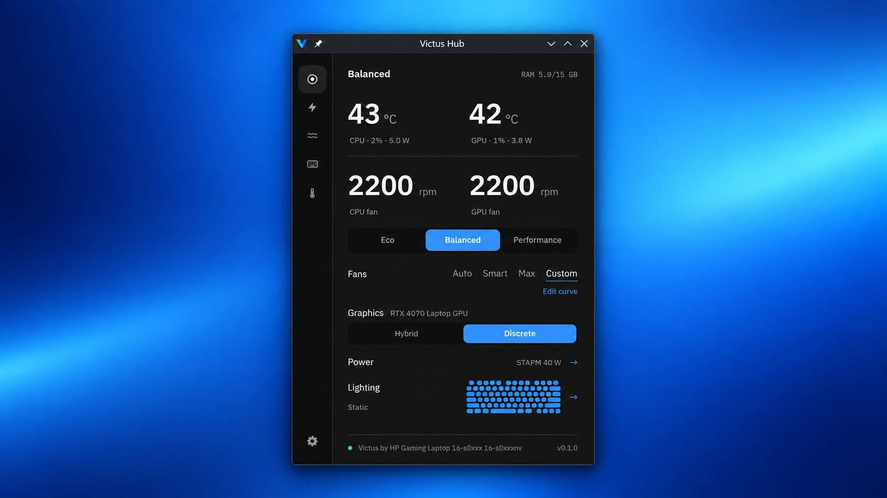
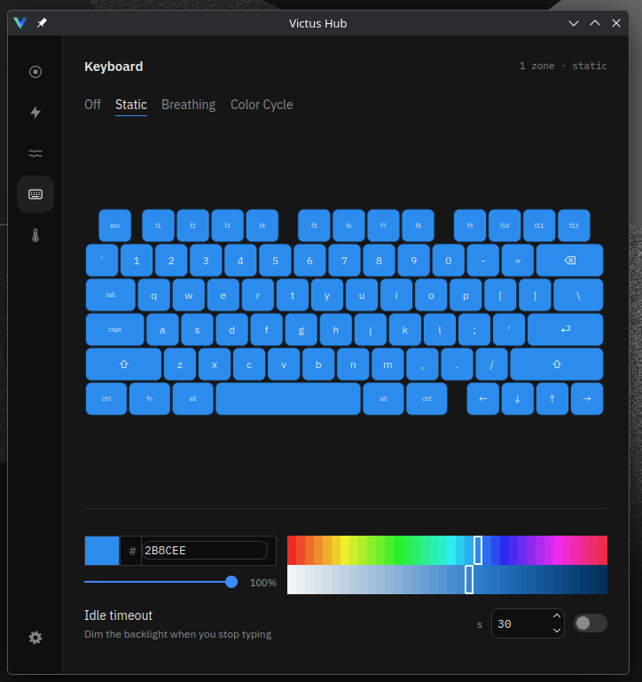
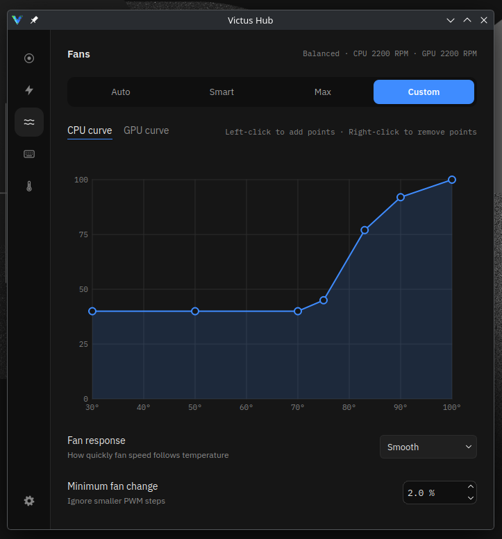

# Victus Hub



A lightweight control panel for HP Victus and Omen laptops on Linux. 

It was built and tested on 8BD4 (HP Victus 16-s0001nv) 
with Fedora.

The panel and the root daemon are a Cargo workspace (`victus-hub` and `victus-hubd`). The panel is a GTK 4 and libadwaita window. Python stays in the tree as the behavior reference. `cargo build --release` writes both binaries under `target/release/`. `scripts/install` builds them and installs the binaries; it does not create a Python virtualenv. `VICTUS_HUB_OFFLINE=1` opens the panel without connecting to a daemon.

Building requires Rust 1.90 or newer, GTK 4.14 or newer, libadwaita 1.5 or newer, and their development/pkg-config packages. The installer builds in a temporary directory using the invoking user's home and cache, including when the source checkout under `/opt` belongs to root.

The Sensors page uses `libsensors.so.5` when available, honoring lm-sensors `compute`, `label`, and `ignore` configuration without starting a subprocess for each sample. If the library is unavailable or cannot initialize, it falls back to raw hwmon readings. At startup the daemon imports the desktop user's `~/.config/victus-hub` once when it has no initialized policy, then applies that policy itself. It uses `VICTUS_HUB_CONFIG_DIR` when set, otherwise the active seat0 account, otherwise the only account under `/home` that has those files. An existing daemon policy stays authoritative.

## Install (One-Liner)
```
curl -sL https://raw.githubusercontent.com/evident0/victus-hub/master/install.sh | sudo bash
```

## Uninstall (One-Liner)
```
curl -sL https://raw.githubusercontent.com/evident0/victus-hub/master/uninstall.sh | sudo bash
```

## What it does
- **System profiles** — maps the three UI profiles to `tuned-adm`
   or `power-profilesctl`.
- **Custom fan control** — Four modes:
  *auto* (hands control back to the EC), *smart* (built-in curve, fast
  on heat / slow on cooldown), *max* (100%), and *custom* (your
  temperature curves).
- **Mux switch** Hardware Mux switch support.
- **Keyboard RGB** — static color and brightness via a custom
  `hp-kbd-rgb` kernel module. Optional idle-dim when
  you stop typing.
- **Power limits** — set Sustained (sPPT), Fast (fPPT), and Slow limits,
  plus Tctl temperature, through `ryzenadj` for AMD CPUs. Intel CPUs show
  PL1 (long-term) and PL2 (short-term) limits using Linux RAPL.
- **Intel undervolt** — core and cache voltage offsets below the frequency
  controls, from -250 to 0 mV. Requires the `msr` kernel module
  (`sudo modprobe msr`) and unlocked firmware voltage control. Apply errors
  are shown in the panel; successful offsets are saved but only applied on
  clicking **Apply undervolt**. Set both offsets to 0 mV to reset them.
- **Sensors** — live CPU/GPU temperatures, fan RPM, power draw, and
  utilization.
- **Keyboard control shortcuts** Keyboard shortcuts for lighting and performance mode. 

Settings persist under `~/.config/victus-hub/`.

Keyboard Panel            |  Fans Panel
:-------------------------:|:-------------------------:
  |  

## Installing (manual)

After cloning the repository run:

```
./scripts/install
```

To check requirements without installing anything:

```bash
bash scripts/install --check
```

### Distribution requirements

The scripts support conventional systemd-based Ubuntu, Linux Mint, Fedora,
and Arch installations. Desktop launchers prefer Wayland and fall back to X11
(including Mint Cinnamon). The installer reports missing packages; install
them with your distribution's package manager before rerunning it.

| Distribution | Kernel build package | Initramfs tool |
| --- | --- | --- |
| Ubuntu / Linux Mint | `linux-headers-$(uname -r)` | `update-initramfs` |
| Fedora | `kernel-devel-$(uname -r)` | `dracut` |
| Arch | `linux-headers`, or matching flavour such as `linux-lts-headers` | `mkinitcpio` or `dracut` |

**The kernel API matters as well as the distribution.** The current driver
requires `devm_platform_profile_register`; older kernels such as the 6.8
base kernel in Ubuntu 24.04 / Mint 22 do not provide it. Use a newer supported
kernel (for example an appropriate Ubuntu HWE / Mint Update Manager kernel),
boot it, and install its matching headers. Installing more headers for an
older kernel does not add the missing API. Secure Boot automatic signing
also requires DKMS 3 or newer and a shim/MOK-capable boot chain; Arch systems
using only custom firmware keys need their own key-enrollment setup.

RGB is optional: if `hp-kbd-rgb` cannot load (for example on a keyboard without
supported RGB), installation continues with a message and disables its boot
autoload entry. Fan control and the rest of the app can still be installed.
Driver compilation/signing errors are reported as installation failures.

### Secure Boot

Secure Boot can stay enabled. Install `mokutil`, `openssl`, and the kernel
headers/devel package matching `uname -r` before running the installer. Both
custom drivers (`hp-wmi` and `hp-kbd-rgb`) are signed automatically using a
shared key stored under `/var/lib/victus-hub/mok/` with root-only access.

On the first install, choose a one-time password when `mokutil` prompts you
(this also works with the one-liner installer). Installation finishes, but
the new drivers are not loaded until you enroll the key:

1. Reboot into the **MOK Manager** screen provided by your shim bootloader.
2. Choose **Enroll MOK → Continue → Yes**.
3. Enter the password you chose during installation, then reboot again.

The signed drivers are configured to load at boot. Until enrollment is
complete, features requiring the custom drivers may be unavailable. A
shim/MOK-capable boot chain is required for this enrollment workflow.
If installing without a terminal, or if you need to retry enrollment, run:

```bash
sudo mokutil --import /var/lib/victus-hub/mok/MOK.der
```

### Kernel updates

The main installer registers both drivers with DKMS using root-owned source
copies under `/usr/src/victus-hub-hp-*`. Distribution DKMS kernel/header hooks
automatically rebuild them for new kernels. **Keep matching kernel headers
installed** (on Arch use the headers package for your kernel flavour).
The hp-wmi hook updates module selection and regenerates the initramfs using
the installed distro tool. Uninstall removes DKMS registrations for all kernels.

Check `dkms status` after a kernel update. A future incompatible kernel can
still cause a build failure; inspect `/var/lib/dkms/` build logs and boot the
previous working kernel until the driver is updated. The low-level scripts
under `kernel/*/scripts/` remain single-kernel development helpers; use the
main installer for DKMS-managed distribution installs.

## Uninstalling

```
./scripts/uninstall
```
Your settings under `~/.config/victus-hub/` and Secure Boot signing keys under
`/var/lib/victus-hub/mok/` are left in place.

## Updating

In Settings, select **Check for updates**. When GitHub has a newer release,
choose **Update**. Victus Hub closes and runs the standard installer in a
terminal:

```bash
curl -sL https://raw.githubusercontent.com/evident0/victus-hub/master/install.sh | sudo bash
```

The installer stops the open app and installs current master. When the
`hp-wmi` and `hp-kbd-rgb` sources match the DKMS modules already installed
for this kernel, and those builds are the ones currently loaded, the
installer leaves the modules in place. It still replaces the program and
daemon and restarts `victus-hubd`. The terminal stays open so progress and
errors remain visible. The in-app Update button opens Victus Hub again after
that installer exits. The command can also be run directly.

## Running

From the application menu (look for "Victus Hub"), or:

```
victus-hub
```

## Logging/Debugging

To refresh the app and daemon after editing this checkout, run from your
desktop session **without sudo**:

```bash
./scripts/install --app-only
VICTUS_HUB_DEBUG_LEVEL=3 victus-hub
```

This refreshes the app-only installation, restarts `victus-hubd`, and restarts
your UI from the updated installation. It requests sudo for system changes and
leaves kernel modules and the RyzenAdj installation in place. The UI runs in
the terminal; the daemon stays running after it closes.

For UI-only development, `./scripts/ui-test` runs the Rust panel with
offline sensor graphs and emulated RGB, without hardware writes or connecting
to the installed daemon.

The app logs to the terminal it was launched from (so run it from a
terminal or check the desktop entry's output). The daemon logs via
`journalctl -u victus-hubd`.

`scripts/ui-test` takes no arguments. For the installed app, set
`VICTUS_HUB_DEBUG_LEVEL`:

| Level | Terminal messages |
| --- | --- |
| `0` (default) | Errors only |
| `1` | Errors + fan control |
| `2` | Errors + fan control + power |
| `3` | Errors + fan control + power + keyboard |

To log fan commands from the running daemon, set its environment variable through a systemd override:
```
sudo systemctl edit victus-hubd
```
Add this in the editor:
```
[Service]
Environment=VICTUS_HUB_DEBUG_LEVEL=1
```
Save, then apply it and follow the logs:
sudo systemctl restart victus-hubd
journalctl -u victus-hubd -f -o cat

## UI regression checks

Run the model/backend tests with `cargo test --workspace`. The GTK regression
test also exercises all six pages, AMD/Intel controls, single-/multi-zone
keyboards, numeric editing, and the sensor context menu. It needs a display:

```bash
xvfb-run -a env GDK_BACKEND=x11 GSK_RENDERER=cairo G_DEBUG=fatal-warnings cargo test -p victus-hub \
  gtk_controls_preserve_pending_edits_and_wire_lighting_and_navigation \
  -- --ignored --nocapture
```

To save page screenshots for comparison with the Python/Qt reference, add
`VICTUS_HUB_UI_SNAPSHOTS=/tmp/victus-ui-snapshots` to the environment in that
command. Screenshots include default pages and alternate power, fan, lighting,
and hardware configurations.

## Project Structure

- **`crates/victus-hub/`** — the GTK GUI. The user runs this unprivileged. It
  sends desired state (fan curves, lighting, power policy) to the daemon
  over a Unix socket. Sensor display and the keyboard preview stay in the UI.
- **`crates/victus-hubd/`** — the root daemon. Runs as a systemd service
  (`victus-hubd.service`), listens on `/run/victus-hubd/victus-hub.sock`,
  owns the control loops, and persists last policy under
  `/var/lib/victus-hubd/` so fans, lighting, and power limits keep working
  with the UI closed (a CLI can use the same socket later).
- **`kernel/`** — All custom kernel modules.

## Credits

- **P4R1H (https://ohmanapp.github.io/)** For the ui design that I recreated in qt with qt creator. 
- **Literally anyone who contributed code to the hp-wmi driver** <3.
